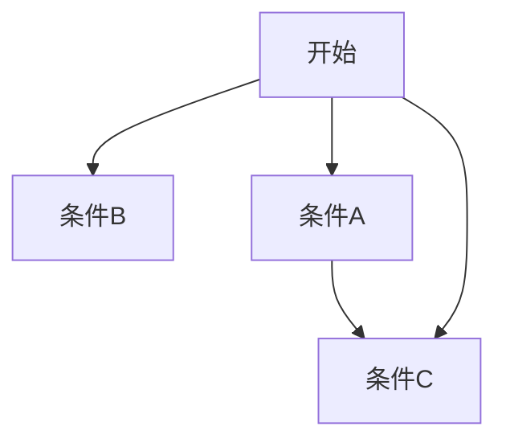

## 使用教程:

aa

Ctrl 0 到Ctrl 4 :普通文本,1~4级标题.

Ctrl B **加粗**

Ctrl I *斜体*

ctrl U <u>下划线</u>

shift alt 5 ~~删除线~~

shift ctrl 点 `行内代码块`

ctrl k [超链接]()

ctrl t 表格

|      |      |      |
| ---- | ---- | ---- |
|      |      |      |
|      |      |      |
|      |      |      |

ctrl shift q 引用

> 

shift ctrl i 图片

上标

x^6^

下标

~~H~~~2~O

<u>Fe~3~O~4~</u>

列表

引用[^3]

[^3]:来自百度

高亮==这是高亮==

注释

<!--这些话不要显示出来-->

内联公式

$e^3$

分割线----

emoji图标

:arrow_double_up:

目录

[toc]

拓展功能

流程图

flowchart

流程图时序图甘特图

```flow

```





```sequence
父亲->>儿子:我是你爹,你得听我的
儿子-->>父亲:好的,我一切都听你的.
儿子->>孙子:听到没,你要听我的
父亲->>孙子:你不要听他的,你听我的
孙子-->>父亲:我到底听谁的?
note left of 儿子:啊哈,蒙圈了

```


 [timg.jfif](timg.jfif) 